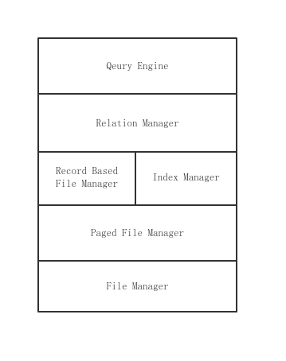

# PeterDB

### Components:
 - PagedFileManager
 - RecordBasedFileManager
 - RelationManager
 - IndexManage
 - QueryEngine

 The structure of the whole system is as follows:

  
 
### File Manager
- Handles the open and close of a file
- Maintains information about the current files

### Paged File Manager
- Data is organized as pages in a file
- This module encapsulates operations conducted in the page level

### Record Based File Manager
- In a relational database, every row in a database is stored as a record
- The format of the record is important
  - The attribute with a null value should occupy zero space
  - An O(1) access method for every attribute should be provided
- It's vital to leave no empty space in a page to save space and also accelerate later operations
  - So it's important to compact the space if necessary
  - And when it comes to update, the record may need to move to other pages in case there is no more space

### Index Manager
- B+ tree based index(Great performance for range search)
  - Please refer to this link for more details [B+ tree Wiki](https://en.wikipedia.org/wiki/B%2B_tree#:~:text=A%20B%2B%20tree%20is%20an,with%20two%20or%20more%20children.)
- The index has to be persistent which means most of the tree nodes are stored as pages in a file
- The key problem here is to split the node when it becomes too full, things are quite different when dealing with files
- The implementation referred to the pseudocode in the book Database Management Systems, 3rd edition, by R. Ramakrishnan and J. Gehrke, McGraw Hill, 2003.

### Relation Manager
- The tables in a relational database is also known as relations
- This module combines Record Manager and Index Manager. Providing methods to create and delete a relation and CRUD the tuples in a relation
  - The CRUD operation on tuples often comes with the manipulations to the corresponding index

### Query Engine
- Implement the basic operations in a relational database
  - Projection
  - Filter
  - Join
  - Group by
  - Aggregation
