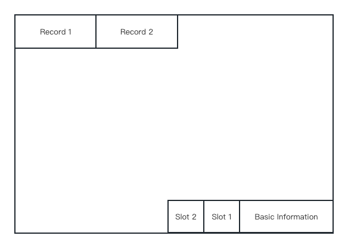

## Project 1 Report

### 1. Basic information
 - Team #:
 - Github Repo Link: https://github.com/UCI-Chenli-teaching/cs222-winter23-songjiahaocoding
 - Student 1 UCI NetID: jiahaos7
 - Student 1 Name: Jiahao Song
 
### 2. Internal Record Format
- Show your record format design.
    - Record start with the number of fields which is 2 bytes
    - Next is the null field indicator, the length depends on the number of fields
    - Index data will come next which contains the offset from the beginning of the record
      to the actual data. Each index will occupy 2 bytes
    - The last part is the value of each field.
    It can be illustrated as below:
  

- Describe how you store a null field.
  
  A null field will not be stored, and its absence will be indicated through the null indicatro.

- Describe how you store a VarChar field.

  - Every varchar field will start with its length
  - The actual data will then be stored following the size information

- Describe how your record design satisfies O(1) field access.
  - Every time I want to access the field. I will first check if it's null or not by looking in 
  the null indicator.
  - Then jump to the corresponding index field which is quite easy as the index size is fixed.
  - Finally, we can know the position of a field and get the data.

### 3. Page Format
- Show your page format design.
  - All the records will be stored from the beginning of each page.
  - At the end, I store some basic information such as the offset from the beginning to the 
    last record, current records and so on. 
  - And there is slots which is related to specific record. The slot part will grow in the opposite direction as the record grows.
    The slot of the first record will be stored right next to the basic information part.
  It can be illustrated as below:
  
  
- Explain your slot directory design if applicable.
  - The slots will store the offset of that record as well as its size. 

### 4. Page Management
- Show your algorithm of finding next available-space page when inserting a record.
  - As I store two offsets for the data and the information, I can easily compute the remaining space
  using these two information.
  - I will start from the last page and look for a page which the record can fit in. 

- How many hidden pages are utilized in your design?
  - The page will always hold one hidden page which I can infoPage at the very beginning.

- Show your hidden page(s) format design if applicable
  - The hidden page just store four information about the all the pages:
    - WRITE_NUM: The sum of total write operations
    - READ_NUM: The sum of total read operations
    - APPEND_NUM: The sum of total append operations
    - ACTIVE_PAGE_NUM: The current number of pages in this file

### 5. Implementation Detail
- Other implementation details goes here.

### 6. Member contribution (for team of two)
- Explain how you distribute the workload in team.

### 7. Other (optional)
- Freely use this section to tell us about things that are related to the project 1, but not related to the other sections (optional)

- Feedback on the project to help improve the project. (optional)