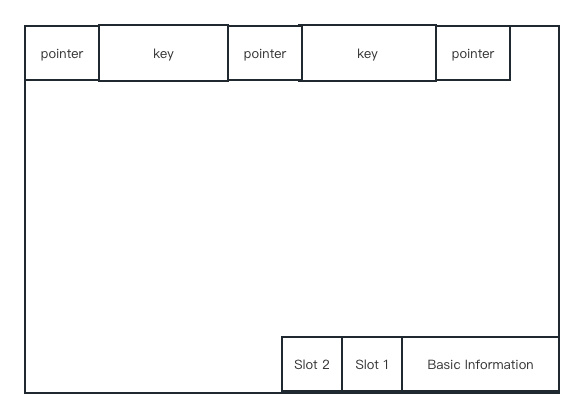
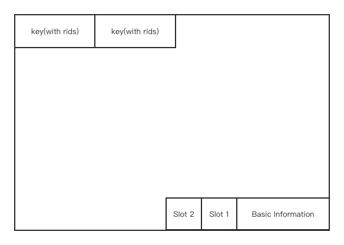

## Project 3 Report

### 1. Basic information
- Team #:
- Github Repo Link: https://github.com/UCI-Chenli-teaching/cs222-winter23-songjiahaocoding
- Student 1 UCI NetID: jiahaos7
- Student 1 Name: Jiahao Song

### 2. Meta-data page in an index file
- Show your meta-data page of an index design if you have any. 
  - I only store the pageNum of the root node in the meta-data page.

### 3. Index Entry Format
- Show your index entry design (structure). 

- entries on internal nodes:  
  - The entries on internal node will only contain the key
  
- entries on leaf nodes:
  - The entries on leaf nodes are composed of two parts
    - Key: Same as the one on internal nodes
    - RID: RID with the same key will be placed after the key one by one

### 4. Page Format
- Show your internal-page (non-leaf node) design.
  - The format of internal nodes is as follows:
    

- Show your leaf-page (leaf node) design.
  - The format of leaf is as follows:
    

### 5. Describe the following operation logic.
- Split
  - For split happening on internal node:
    - Find the last half number of keys, exclude the first key K_MID.
    - Build the new page according to the keys got previously. 
    - Update the information of both of the pages
    - Return K_MID so it can be used in the child entry to be passed to upper level. 
    - In caller function, insert the entry based on the K_MID(into the old page or the new page).
  - For split happening on leaf node:
    - The first half of keys remain in the page, the last half goes to the new page.
    - Update the information of both of the pages.
    - IN caller function, insert the entry based on the first key in the new page. 

- Rotation (if applicable)

- Merge/non-lazy deletion (if applicable)

- Duplicate key span in a page
  - The rids of the same key will be arranged after the key one by one which is a linear structure
  - When the insert happens, it will insert to the end of the rid list.
  - During search, it will traverse all the rids of one key to find the correct one. 

- Duplicate key span multiple pages (if applicable)

### 6. Implementation Detail
- Have you added your own module or source file (.cc or .h)? 
  Clearly list the changes on files and CMakeLists.txt, if any.
  No.

- Other implementation details:

### 7. Member contribution (for team of two)
- Explain how you distribute the workload in team.

### 8. Other (optional)
- Freely use this section to tell us about things that are related to the project 3, but not related to the other sections (optional)

- Feedback on the project to help improve the project. (optional)
