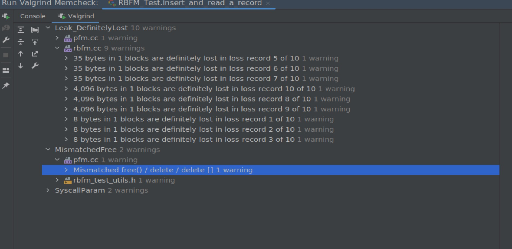
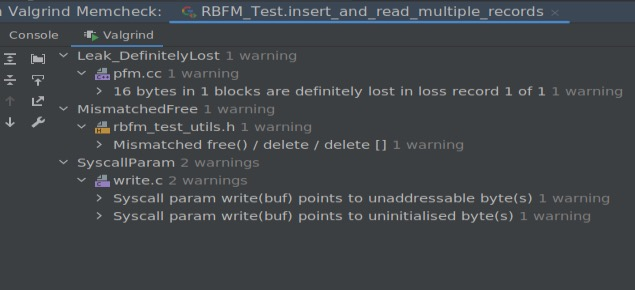

## Debugger and Valgrind Report

### 1. Basic information
 - Team #:
 - Github Repo Link: https://github.com/UCI-Chenli-teaching/cs222-winter23-songjiahaocoding
 - Student 1 UCI NetID: jiahaos7
 - Student 1 Name:Jiahao Song

### 2. Using a Debugger
- I use CLion debugger most of the time. As I defined some classes, I will check tha variables during
debugging to make sure everything is on track.
- Another very important feature about Clion debugger is that I can jump to the memory of the variables
to see what's in the memory to see what's really going on. 
- Next important tip is that use different command while debugging wisely, such as step into, step over.

### 3. Using Valgrind
- I integrate Valgrind with the Clion on an Ubuntu machine. 
- When I want to debug with Valgrind, I will just run with Valgrind Memcheck.
- The most important bugs I found using Valgrind is the memory leak. I found I allocate memory space to 
many pointers which I forgot to delete/free. Here is a screenshot about the Valgrind report:

- After inspecting all the warning, I have successfully avoided almost all the errors. Here is a screenshot
after the revision. 
